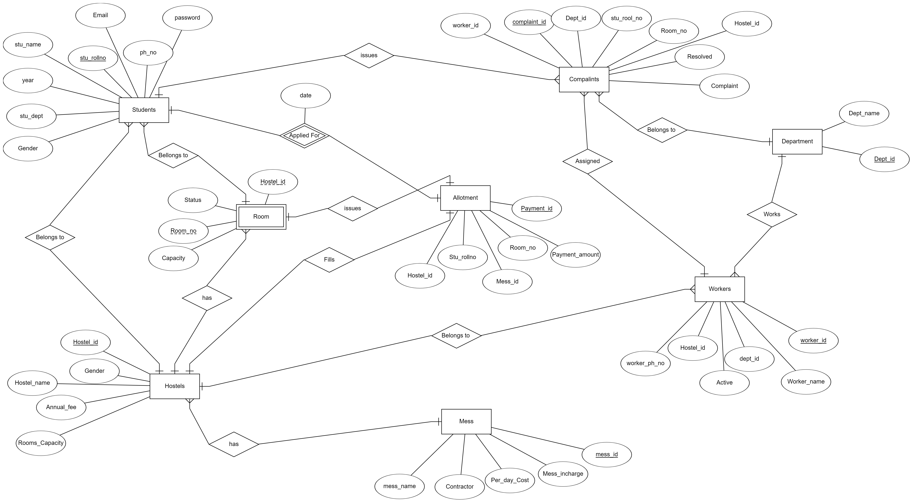

# Hostel_management_system
 Welcome to Hostel Database Management system Project!

# Project Overview
 The Hostel Database project is designed to provide a centralized system for managing hostel-related data. It aims to simplify tasks such as managing student records, room allocations, maintenance requests, and overall hostel administration. The project utilizes a relational database management system to store and retrieve data efficiently.

# Database Entities
 There are 8 entities in this database. They are
 - Students
 - Hostel
 - Rooms
 - Work
 - Worker
 - Mess
 - Allotment
 - Complaints

 Each entity consists of several attributes.

# Entity Relationship diagram

# Contributors
<table>
    <tr>
        <th>
            
            <a href="https://github.com/Abhinay-c">Abhinay Challa</a>
        </th>
        <th>
            <a href="https://github.com/Nikhil-0088">Nikhil B</a>
        </th>
        <th>
            <a href="https://github.com/">Vignesh Bejugam</a>
        </th>
    </tr>
</table>